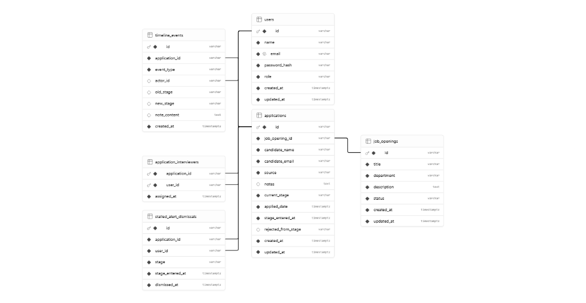
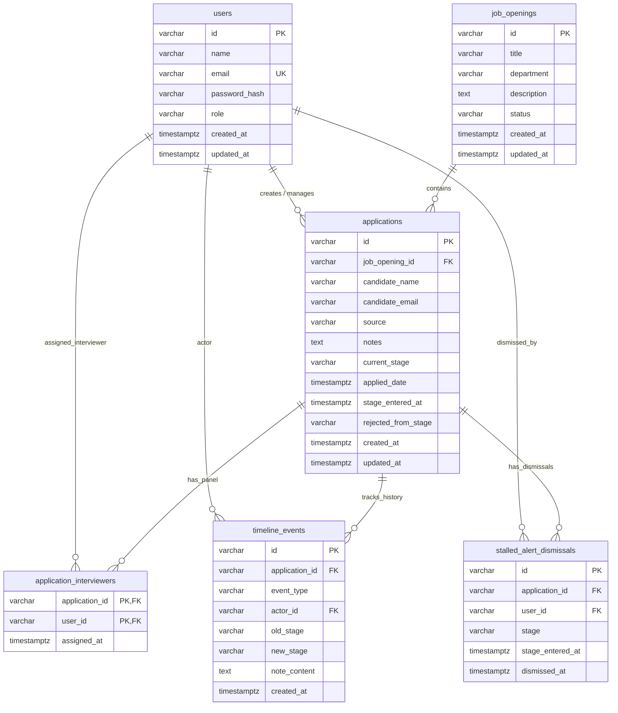

# Schema Documentation

This document describes the PostgreSQL relational database model for the **HireFlow** Hiring Pipeline Management System.

---

## 1. Entity-Relationship Diagram





---

## 2. Table Definitions

## Table `users`

### Columns

| Name | Type | Constraints |
|------|------|-------------|
| `id` | `varchar` | Primary |
| `name` | `varchar` |  |
| `email` | `varchar` |  Unique |
| `password_hash` | `varchar` |  |
| `role` | `varchar` |  |
| `created_at` | `timestamptz` |  |
| `updated_at` | `timestamptz` |  |

---

## Table `job_openings`

### Columns

| Name | Type | Constraints |
|------|------|-------------|
| `id` | `varchar` | Primary |
| `title` | `varchar` |  |
| `department` | `varchar` |  |
| `description` | `text` |  |
| `status` | `varchar` |  |
| `created_at` | `timestamptz` |  |
| `updated_at` | `timestamptz` |  |

---

## Table `applications`

### Columns

| Name | Type | Constraints |
|------|------|-------------|
| `id` | `varchar` | Primary |
| `job_opening_id` | `varchar` |  |
| `candidate_name` | `varchar` |  |
| `candidate_email` | `varchar` |  |
| `source` | `varchar` |  |
| `notes` | `text` |  Nullable |
| `current_stage` | `varchar` |  |
| `applied_date` | `timestamptz` |  |
| `stage_entered_at` | `timestamptz` |  |
| `rejected_from_stage` | `varchar` |  Nullable |
| `created_at` | `timestamptz` |  |
| `updated_at` | `timestamptz` |  |

---

## Table `application_interviewers`

### Columns

| Name | Type | Constraints |
|------|------|-------------|
| `application_id` | `varchar` | Primary |
| `user_id` | `varchar` | Primary |
| `assigned_at` | `timestamptz` |  |

---

## Table `timeline_events`

### Columns

| Name | Type | Constraints |
|------|------|-------------|
| `id` | `varchar` | Primary |
| `application_id` | `varchar` |  |
| `event_type` | `varchar` |  |
| `actor_id` | `varchar` |  Nullable |
| `old_stage` | `varchar` |  Nullable |
| `new_stage` | `varchar` |  Nullable |
| `note_content` | `text` |  Nullable |
| `created_at` | `timestamptz` |  |

---

## Table `stalled_alert_dismissals`

### Columns

| Name | Type | Constraints |
|------|------|-------------|
| `id` | `varchar` | Primary |
| `application_id` | `varchar` |  |
| `user_id` | `varchar` |  |
| `stage` | `varchar` |  |
| `stage_entered_at` | `timestamptz` |  |
| `dismissed_at` | `timestamptz` |  |

---

## 3. Relationships Overview

### One-to-Many Relationships
* **`job_openings` → `applications`**: One job opening contains many applications. An application belongs to exactly one opening (`ON DELETE RESTRICT` protects openings with existing applicants from deletion).
* **`applications` → `timeline_events`**: One application owns many immutable audit log events (`ON DELETE CASCADE`).
* **`users` → `timeline_events`**: One user can act as the author (`actor_id`) for many timeline events (`ON DELETE SET NULL` preserves event history if a user account is deleted).
* **`applications` → `stalled_alert_dismissals`**: One application can have dismissals across different stages and time periods (`ON DELETE CASCADE`).

### Many-to-Many Relationships
* **`applications` ↔ `users` (Interviewers)**: Connected via the `application_interviewers` junction table. One application can be assigned multiple interviewers, and one interviewer can evaluate multiple applications. Duplicate assignments are prevented by the composite primary key `(application_id, user_id)`.

---

## 4. Constraints: Database vs. Application Layer

### Enforced in Database (PostgreSQL DDL):
1. **Primary & Foreign Keys**: Primary keys on all tables; foreign key referential integrity with cascading or restricted deletes.
2. **Uniqueness**:
   * `users(email)`: Prevents duplicate account registration.
   * `stalled_alert_dismissals(application_id, stage, stage_entered_at)`: Guarantees dismissal uniqueness per stalled period.
   * `application_interviewers(application_id, user_id)`: Prevents assigning the same interviewer twice to one candidate.
3. **Check Constraints**:
   * `role IN ('RECRUITER', 'INTERVIEWER')`
   * `status IN ('OPEN', 'ARCHIVED')`
   * `current_stage IN ('APPLIED', 'SCREENING', 'INTERVIEW', 'OFFER', 'HIRED', 'REJECTED')`
   * `check_rejected_origin`: Mandates that `rejected_from_stage` cannot be null if `current_stage = 'REJECTED'`.

### Enforced in Application Code (Node/Express):
1. **Linear Pipeline Progression**: Validates that candidates can only advance forward one stage at a time (`APPLIED → SCREENING → INTERVIEW → OFFER → HIRED`). Rejects illegal skips with HTTP 422.
2. **Reinstatement Target**: Ensures candidates are restored strictly to their exact recorded `rejected_from_stage`.
3. **Role-Based Authorization (RBAC)**: Enforces recruiter-only capabilities (advancing stages, managing openings, bulk actions) and scopes interviewer visibility strictly to their assigned candidates.
4. **Append-Only Timeline Immutability**: Prohibits any update or delete operations on `timeline_events`.

---

## 5. Deliberately Denormalised Fields

* **`rejected_from_stage` in `applications`**: Stored directly on the application row so that restoring a rejected candidate to their previous stage is an immediate $O(1)$ read and write, rather than requiring a descending historical scan over `timeline_events`.
* **`stage_entered_at` in `applications`**: Stored on the application row to allow instantaneous indexing for the 10-day inactivity alert query, avoiding expensive aggregate `MAX(created_at)` calculations across millions of timeline rows.

---

## 6. What Would Break First at 100x Data

At 100x scale (e.g., 2,500,000 applications, 20,000,000 timeline events, 50,000 job openings):

1. **Stalled Application Alert Query (`GET /api/alerts/stalled`)**:
   * *What breaks:* The `LEFT JOIN` between `applications` and `stalled_alert_dismissals` filtering by `stage_entered_at <= NOW() - 10 days` will degrade into sequential or hash joins scanning millions of historical and terminal applications.
   * *Remediation:* Create a partial index:
     ```sql
     CREATE INDEX idx_apps_active_stalled 
     ON applications (stage_entered_at) 
     WHERE current_stage IN ('APPLIED', 'SCREENING', 'INTERVIEW', 'OFFER');
     ```

2. **Timeline Event Volume (`GET /api/applications/:id/timeline`)**:
   * *What breaks:* Unbounded retrieval of timeline events for applications with long interview loops will cause high memory usage and query latency.
   * *Remediation:* Partition `timeline_events` by range on `created_at` (monthly) and enforce cursor-based pagination (`LIMIT 50 WHERE id < $cursor`).

3. **Dashboard Weekly Trend Calculations**:
   * *What breaks:* Scanning 12 weeks of historical stage changes across millions of timeline events on every dashboard visit will cause CPU spikes.
   * *Remediation:* Implement a PostgreSQL Materialized View refreshed periodically, or maintain an hourly summary roll-up table.

4. **CSV Export Memory Buffering**:
   * *What breaks:* Exporting hundreds of thousands of candidate rows at once will exceed Node.js buffer limits and trigger Out-Of-Memory (OOM) process crashes.
   * *Remediation:* Stream database rows in 500-row chunks using `pg-query-stream` directly into the HTTP response stream.
